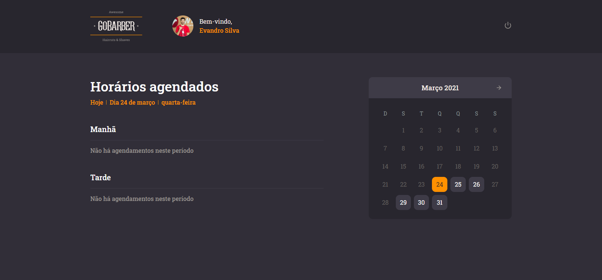

# Screenshots :camera:

  
  
  
  

# Technologies :rocket:
This project was made using the follow technologies:
* [Typescript](https://www.typescriptlang.org/)      
* [React](https://reactjs.org/)    
* [React-Native](https://reactnative.dev/)  
* [Unform](https://unform.dev/)

* [TypeORM](https://typeorm.io/#/)
* [Docker](https://www.docker.com/)
* [PostgreSQL](https://www.postgresql.org/)
* [MongoDB](https://www.mongodb.com/)

# License :page_facing_up:
This project is under the [MIT license](./LICENSE).